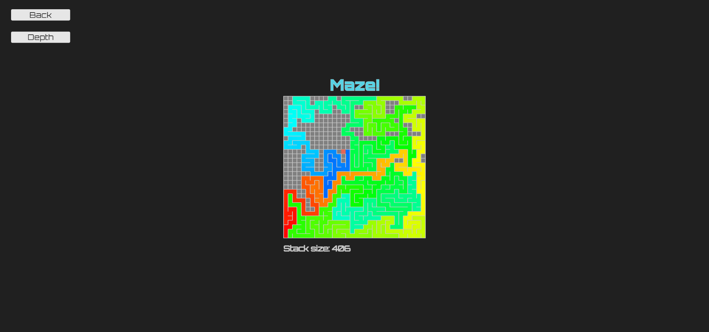

# js-maze_drawer
This proyect draws mazes of different sizes. It was built using <a href="https://p5js.org/">p5.js</a>.
## URL
This proyect is hosted by github pages at <a href="https://pabloqb2000.github.io/js-maze_drawer/">this link</a>.
## Options
  - Number of cells in x axis
  - Number of cells in y axis
  - Size of cells
## Notes
More info about this algorithm can be found in <a href="https://en.wikipedia.org/wiki/Maze_generation_algorithm">Wikipedia</a>.
## Screenshot
</img>
## References
To find more information about the <b>awesome</b> library used for this proyect visit:
<a href="https://p5js.org/"> https://p5js.org/ </a>
